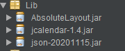
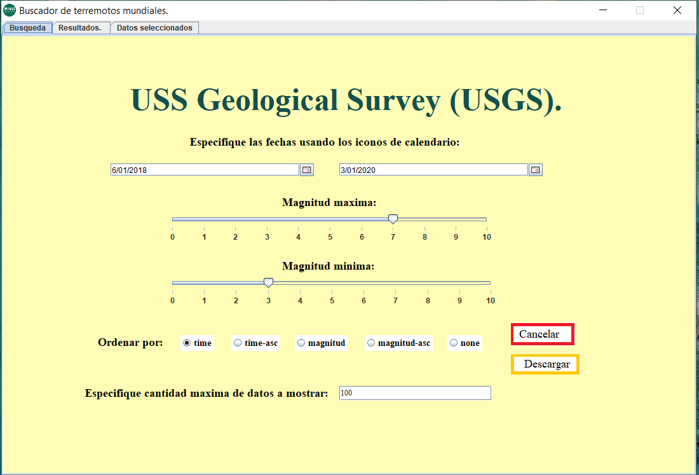
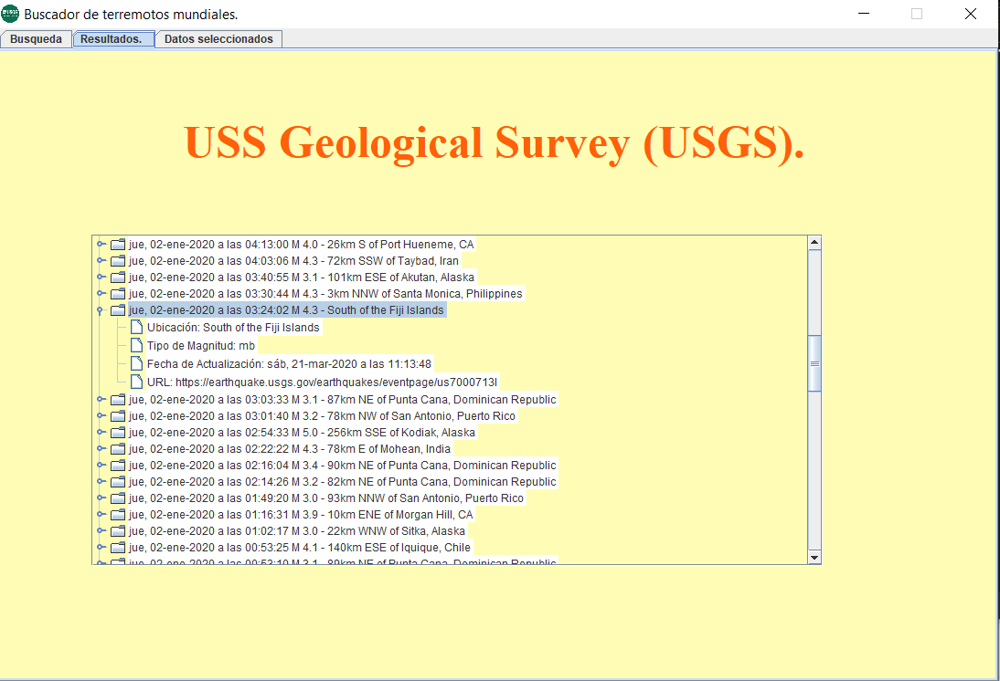
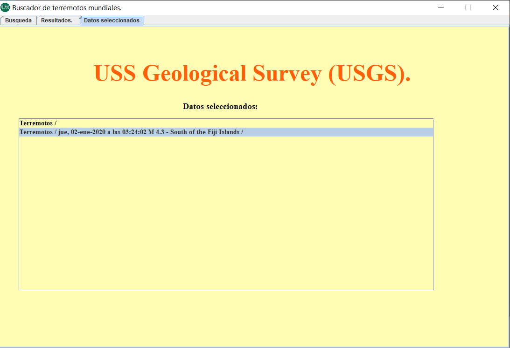

# USS Geological Survey (USGS).

Se desarrollo un programa el cual muestra un listado de los terremotos mas recientes(esto puede ser modificado atraves de dos JCalendar(inicio de fecha y fin de fecha) en el mundo usando una API de la organizacion USS Geological Survey (USGS).

https://earthquake.usgs.gov/fdsnws/event/1/query?format=geojson&starttime=2014-01-01&endtime=2014-01-02

# Prerequisitos.

-IDE (Opcional) o un editor de texto.

-Use tres librerias:

Mismas las cuales nos permiten usar JSON, JTree y JCalendar, necesarias para el funcionamiento correcto de nuestro programa.

# Instalacion.

1.- Se necesita descargar el ZIP del repositorio.

2.- Extraer los ficheros del ZIP en tu computadora o terminal.

3.- Abrir el IDE de preferencia y enlazar tu proyecto.

# Elementos visuales y funcionamiento.

1.- Se usaron ButtonGroup, JRadioButtons (para poder decidir como ordenar la lista de terremotos).

2.- JLabel, JTextField (para decidir el limite de datos a mostrar).

3.- JTree (Para mostrar la informacion).

4.- JPanel (Para mostrar las 3 ventanas(Buscar, Resultados, y Resultados elegidos).

5.- JScrollPane y JList (Muestra la informacion con un formato en especifico).

6.- JButton (Para descargar y cancelar la informacion).

7.- JDateChooser (Dos calendarios para especificar las fechas entre las que se van a buscar los terremotos).

8- JSlider (Dos JSlider para determinar entre que magnitudes de los terremotos generados se buscara.

# Funcionamiento.

https://flipgrid.com/51b3a3dc

# Agradecimientos.

Estuve buscando en diferentes foros y los links que nuestro docente nos mostro para poder realizarlo, todo poco a poco se conectaba, antes realizaba atraves del JForm los botones y demas elementos, pero gracias al AbsoluteConstraints se puede ubicar un elemento por las coordenadas "X" y "Y" al igual que dandole color u otras caracteristicas.

# Referencias. 

https://earthquake.usgs.gov/fdsnws/event/1/query?format=geojson&starttime=2014-01-01&endtime=2014-01-02

https://www.youtube.com/watch?v=iiADhChRriM&ab_channel=WebDevSimplified

https://youtu.be/qzRKa8I36Ww

https://www.codejava.net/java-se/swing/jtree-basic-tutorial-and-examples

https://earthquake.usgs.gov/fdsnws/event/1/

http://www.chuidiang.org/java/JTree/ejemplo-simple-jtree.php

http://www.myjavazone.com/2010/06/jslider.html

# Construido en.

IDE Neat Beans 8.2. 

# Resultados.
La ventana principal en la cual, debemos establecer los valores para filtrar nuestros terremotos.

Una ventana que accedimos atraves de ella por un JPanel, la cual nos muestra los resultados de nuestra busqueda.

La ultima ventana que nos nuestra las rutas o datos seleccionados de nuestros terremotos filtrados.

07/01/2020 3:46 p.m.      Mexico

